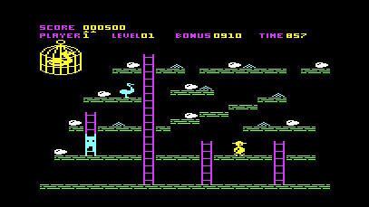

# WiC20 - Portierung des WiC64 auf den VC20 / VIC20

  

Just a proof-of-concept, now it's up to YOU

Was wird benötigt:

<code>
 - VC20, hier mit einer RAM-Erweiterung, abhängig von den zu ladenden Programmen 24k
</code>

<code>
 - WiC64, vollständig eingerichtet (SSID, Password), hier keine Einrichtung möglich
</code>

<code>
 - WiC64 mit der aktuellsten Firmware und dem Patch (s. unten) 
</code>

  

Dann das VC20-Programm <<main.prg>> aus dem Ordner <<vc20-progs>> herunterladen und starten.

  

Dies ist lediglich eine DEMO-Seite mit ein paar Spielen, Demos und SID-Player-Files. Ein Jeder ist dazu aufgerufen, mittels des Quellcodes im Ordner <<code>> für sich oder seinen Retro-Computing-Verein seine eigene Seite aufzubauen. Aktuell werden - wie beim C64 ebenfalls - nur OneFiler unterstützt (keine D64-Dateien).

  

 

Credits:

               Thomas "GMP" Müller <gmp@wic64.de>
             Sven Oliver "KiWi" Arke <kiwi@wic64.de>
          Hardy "Lazy Jones" Ullendahl <lazyjones@wic64.de>
             Henning "YPS" Harperath <yps@wic64.de>
 
 und 

		RetroFan für den VC20-Font und das Logo-/ Farbdesign

Have fun ;-)

cassy-de

